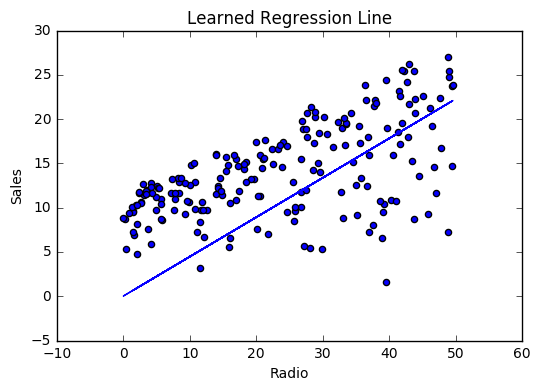

# Linear Regression

- [Linear Regression](#linear-regression)
  - [Introduction](#introduction)
      - [Simple regression](#simple-regression)
      - [Multivariable regression](#multivariable-regression)
  - [Simple regression](#simple-regression-1)
  - [Making predictions](#making-predictions)
      - [Weight](#weight)
      - [Radio](#radio)
      - [Bias](#bias)
        - [Code](#code)
      - [Cost function](#cost-function)
      - [Math](#math)
      - [Code](#code-1)
  - [Gradient descent](#gradient-descent)
      - [Math](#math-1)
      - [Code](#code-2)
---
## Introduction

Linear Regression is a supervised machine learning algorithm where the predicted output is continuous and has a constant slope. It’s used to predict values within a continuous range, (e.g. sales, price) rather than trying to classify them into categories (e.g. cat, dog). There are two main types:

#### Simple regression

Simple linear regression uses traditional slope-intercept form, where 𝑚 and 𝑏 are the variables our algorithm will try to “learn” to produce the most accurate predictions. 𝑥 represents our input data and 𝑦 represents our prediction.

$$ 𝑦 = 𝑚𝑥 + 𝑏 $$

#### Multivariable regression

A more complex, multi-variable linear equation might look like this, where 𝑤 represents the coefficients, or weights, our model will try to learn.

$$ 𝑓(𝑥,𝑦,𝑧) = 𝑤1𝑥 + 𝑤2𝑦 + 𝑤3𝑧 $$

The variables 𝑥,𝑦,𝑧 represent the attributes, or distinct pieces of information, we have about each observation. For sales predictions, these attributes might include a company’s advertising spend on radio, TV, and newspapers.

$$ 𝑆𝑎𝑙𝑒𝑠 = 𝑤1𝑅𝑎𝑑𝑖𝑜 + 𝑤2𝑇𝑉 + 𝑤3𝑁𝑒𝑤𝑠 $$

## Simple regression

Let’s say we are given a dataset with the following columns (features): how much a company spends on Radio advertising each year and its annual Sales in terms of units sold. We are trying to develop an equation that will let us to predict units sold based on how much a company spends on radio advertising. The rows (observations) represent companies.

| Company | Radio ($) |	Sales |
|---|---|---|
| Amazon | 37.8	| 22.1 |
| Google | 39.3 | 10.4 |
| Facebook | 45.9 | 18.3 |
| Apple | 41.3 | 18.5 |

## Making predictions

Our prediction function outputs an estimate of sales given a company’s radio advertising spend and our current values for Weight and Bias.

$$ 𝑆𝑎𝑙𝑒𝑠 = 𝑊𝑒𝑖𝑔ℎ𝑡 ⋅ 𝑅𝑎𝑑𝑖𝑜 + 𝐵𝑖𝑎𝑠 $$

#### Weight
the coefficient for the Radio independent variable. In machine learning we call coefficients weights.

#### Radio
the independent variable. In machine learning we call these variables features.

#### Bias
the intercept where our line intercepts the y-axis. In machine learning we can call intercepts bias. Bias offsets all predictions that we make.

Our algorithm will try to learn the correct values for Weight and Bias. By the end of our training, our equation will approximate the line of best fit.



##### Code
```py
def predict_sales(radio, weight, bias):
    return weight*radio + bias
```

#### Cost function

The prediction function is nice, but for our purposes we don’t really need it. What we need is a cost function so we can start optimizing our weights.

Let’s use MSE (L2) as our cost function. MSE measures the average squared difference between an observation’s actual and predicted values. The output is a single number representing the cost, or score, associated with our current set of weights. Our goal is to minimize MSE to improve the accuracy of our model.

#### Math

Given our simple linear equation $𝑦 = 𝑚𝑥 + 𝑏$, we can calculate MSE as:

$$ MSE = \frac{1}{N} \sum_{i=1}^n (y_i-(mx_i+b))^2 $$

Note
  - $𝑁$ is the total number of observations (data points)
  - $\frac{1}{𝑁}\sum_{𝑖=1}^𝑛$ is the mean
  - $𝑦_𝑖$ is the actual value of an observation and 𝑚𝑥𝑖+𝑏 is our prediction

#### Code
```py
def cost_function(radio, sales, weight, bias):
    companies = len(radio)
    total_error = 0.0
    for i in range(companies):
        total_error += (sales[i] - (weight*radio[i] + bias))**2
    return total_error / companies
```

## Gradient descent

To minimize MSE we use Gradient Descent to calculate the gradient of our cost function. Gradient descent consists of looking at the error that our weight currently gives us, using the derivative of the cost function to find the gradient (The slope of the cost function using our current weight), and then changing our weight to move in the direction opposite of the gradient. We need to move in the opposite direction of the gradient since the gradient points up the slope instead of down it, so we move in the opposite direction to try to decrease our error.

#### Math

There are two parameters (coefficients) in our cost function we can control: weight 𝑚 and bias 𝑏. Since we need to consider the impact each one has on the final prediction, we use partial derivatives. To find the partial derivatives, we use the Chain rule. We need the chain rule because (𝑦−(𝑚𝑥+𝑏))2 is really 2 nested functions: the inner function 𝑦−(𝑚𝑥+𝑏) and the outer function 𝑥2.

Returning to our cost function:

$$  f(m,b)=\frac{1}{N}\sum_{i=1}^n(mx_i+b)^2 $$

Using the following:

$$ (𝑦_𝑖−(𝑚𝑥_𝑖+𝑏))^2=𝐴(𝐵(𝑚,𝑏)) $$

We can split the derivative into

$$ 𝐴(𝑥)=𝑥^2 $$
$$ \frac{𝑑𝑓}{𝑑𝑥}=𝐴^′(𝑥)=2𝑥 $$

and

$$ 𝐵(𝑚,𝑏)=𝑦_𝑖−(𝑚𝑥_𝑖+𝑏)=𝑦_𝑖−𝑚𝑥_𝑖−𝑏 $$
$$ \frac{𝑑𝑥}{𝑑𝑚}=𝐵^′(𝑚)=0−𝑥_𝑖−0=−𝑥𝑖 $$ 
$$ \frac{𝑑𝑥}{𝑑𝑏}=𝐵^′(𝑏)=0−0−1=−1 $$

And then using the Chain rule which states:

$$ \frac{𝑑𝑓}{𝑑𝑚}=\frac{𝑑𝑓}{𝑑𝑥}\frac{𝑑𝑥}{𝑑𝑚} $$
$$ \frac{𝑑𝑓}{𝑑𝑏}=\frac{𝑑𝑓}{𝑑𝑥}\frac{𝑑𝑥}{𝑑𝑏} $$

We then plug in each of the parts to get the following derivatives

$$ 
\frac{𝑑𝑓}{𝑑𝑚}=𝐴'(𝐵(𝑚,𝑓))𝐵'(𝑚)=2(𝑦_𝑖−(𝑚𝑥_𝑖+𝑏))⋅−𝑥_𝑖\\
\frac{𝑑𝑓}{𝑑𝑏}=𝐴'(𝐵(𝑚,𝑓))𝐵'(𝑏)=2(𝑦_𝑖−(𝑚𝑥_𝑖+𝑏))⋅−1
$$

We can calculate the gradient of this cost function as:

$$
𝑓'(𝑚,𝑏) =
    \begin{bmatrix}
        \frac{𝑑𝑓}{𝑑𝑚}\\
        \frac{𝑑𝑓}{𝑑𝑏}    
    \end{bmatrix}
    =
    \begin{bmatrix}
        \frac{1}{𝑁}\sum−𝑥_𝑖⋅2(𝑦_𝑖−(𝑚𝑥_𝑖+𝑏))\\
        \frac{1}{𝑁}\sum−1⋅2(𝑦_𝑖−(𝑚𝑥_𝑖+𝑏))\\
    \end{bmatrix}\\
    =
    \begin{bmatrix}
        \frac{1}{N}\sum−2𝑥_𝑖(𝑦_𝑖−(𝑚𝑥_𝑖+𝑏)\\
        \frac{1}{𝑁}\sum−2(𝑦_𝑖−(𝑚𝑥_𝑖+𝑏))\\
    \end{bmatrix}
$$

#### Code

To solve for the gradient, we iterate through our data points using our new weight and bias values and take the average of the partial derivatives. The resulting gradient tells us the slope of our cost function at our current position (i.e. weight and bias) and the direction we should update to reduce our cost function (we move in the direction opposite the gradient). The size of our update is controlled by the learning rate.
```py
def update_weights(radio, sales, weight, bias, learning_rate):
    weight_deriv = 0
    bias_deriv = 0
    companies = len(radio)

    for i in range(companies):
        # Calculate partial derivatives
        # -2x(y - (mx + b))
        weight_deriv += -2*radio[i] * (sales[i] - (weight*radio[i] + bias))

        # -2(y - (mx + b))
        bias_deriv += -2*(sales[i] - (weight*radio[i] + bias))

    # We subtract because the derivatives point in direction of steepest ascent
    weight -= (weight_deriv / companies) * learning_rate
    bias -= (bias_deriv / companies) * learning_rate

    return weight, bias
```